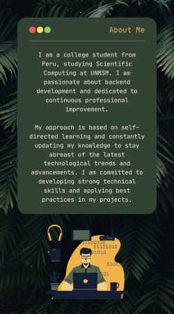
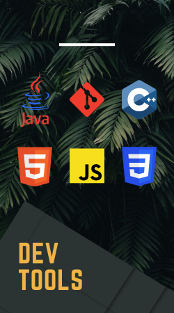

      
    
                         
      
      
       

- 🔭 Estoy estudiando Computacion Cientifica
- 🌱 Espero que mi contenido sea de ayuda
- 👯 Tratare de subir mis trabajos y proyectos que me envian en la universidad
- 🤔 Soy nuevo así que me serviría de ayuda sus consejos en mi repositorio
- 💬 Tratare de dejar lo importante en los README
